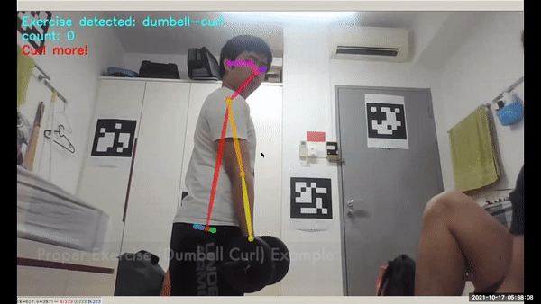

# Kajja


Kajja, is a high-tech, state-of-the-art AI personal trainer. Using an advanced pose estimation model, our system allows real-time guidance and correction of exercises. With ESP32-cameras, each costing under <b>$7</b>.

* [Demonstration video](video/detection.mp4)




### Features
- Interactive experience through **real-time pose recognition**. 

- Uses **computer vision** and **deep learning** Caffe models to guide you through every step when doing your fitness/Gym.

- Users are notified to their action based on how good the **accuracy of their pose** real-time to prevent any injuries.

### About
Kajja is built from ground up keeping user experience in mind to improve users health. Kajja can detect the poses using [OpenPose](https://github.com/CMU-Perceptual-Computing-Lab/openpose) what exercise the user is doing with the use of Time delay Neural Network (TDNN). We help our users keep track of their fitness and exercise, all with a single touch of a button. Kajja keeps track of how many sets and repetitions of whatever type of exercise, without needing our users to interface with any UI.

# Usage
Currently to launch the server, it requires the system to have [nvida docker](https://www.docker.com/) running in the system as well as the use of a docker container for the server to run

```bash
docker pull nelsenew/openpose:cuda11
```

To run the docker container with GPU and GUI access use the following bash command:
```bash
XAUTH=/tmp/.docker.xauth

xauth_list=$(xauth nlist :0 | tail -n 1 | sed -e 's/^..../ffff/')
if [ ! -f $XAUTH ]; then
    if [ ! -z "$xauth_list" ]; then
        echo $xauth_list | xauth -f $XAUTH nmerge -
    else
        touch $XAUTH
    fi
    chmod a+r $XAUTH
fi

file $XAUTH
ls -FAlh $XAUTH

docker run -it --rm \
    --env="DISPLAY=$DISPLAY" \
    --env="QT_X11_NO_MITSHM=1" \
    --volume="/tmp/.X11-unix:/tmp/.X11-unix:rw" \
    --env="XAUTHORITY=$XAUTH" \
    --volume="$XAUTH:$XAUTH" \
    --net=host \
    --privileged \
    --runtime=nvidia \
    --gpus all\
    nelsenew/openpose:cuda11 \
    bash
```

### Problems
* Obesity - a serious worldwide health issue.

* People in normal time, have terribly hectic schedules, they do not have time to go to the gym. Some people are insecure about their bodies so avoid going to public gyms as well.

* Work from home due to the recent COVID pandemic has deteriorated the situation.

* Maintaining correct posture while exercising is essential, as wrong postures can lead to body problems.

* Physical inactivity can lead to diseases, both physical and mental. In these trying times, any kind of disease can be deadly.


### Proposed Solutions

* We propose fitness such as gym as a solution to this issue. Doing gym helps reduce weight as well as cholesterol, thus this will be helpful for diabetics out there. Fitness and Gym also help reduces the symptoms of depression and anxiety.

Kajja is your real-time personal Gym instructor, allowing anyone to harness the benefits of gym from any place.

Kajja will ensure that however busy a person might be, they spend some time of their day in physical activity and mental exercises as they don't have to travel anywhere to exercise.

### Current limitation
* Only 3 exercises (dumbell-curl, push-up and squat) are supported by the application.
* Voice assistant has not been implemented in the hardware.

### Future plan
* Creating an app into for a whole assistant for fitness in general.

* Add personalized diets to assessing requirements and suggesting a whole fitness routine including food items, schedules, and fitness tracks and timings.

* Add more exercise such as plank, sit-up, and more!
